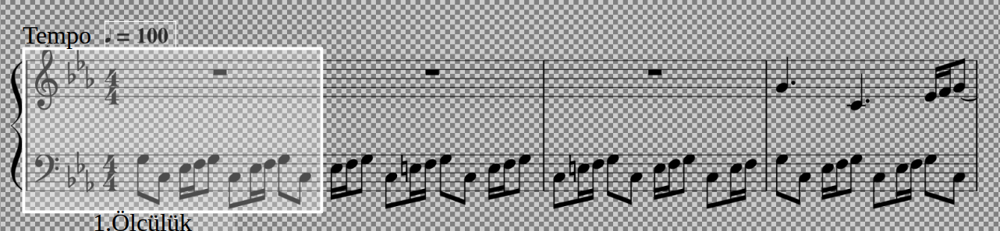

 **Kişisel Bilgileri**  

Öğrenci Ad-Soyad : Mohamed TRAORE 
Öğrenci   Numara : 030117024   
Ders Adı         : Sinyal İşleme 
Proje            : MATLAB ile sentezleme 

**1. Hafta Hedefleri**  
-Müzik notasyon programı olan MuseCore ortamında oluşturulan müziğin MATLAB ortamında parse edilmesi. 
-Müziği sentezlemek üzere note.m ve sentez.m MATLAB dosyalarının oluşturulması.  
-Parse edilmiş datanın incelenmesi ve müziğin sentezleyebilmesi içi lazım olan sütunların tespit edilmesi. 
-Repoya .musicxml .mscz uzantılı müzik dosyaları ve .png uzantılı foto dosyasının eklenmesi. 
  **CEVAPLAR**   
1. Oluşturulan müziğin .png dosyası  

     

   Bu müzik 16 ölçülüklü olmak üzere 229 nota ve restten  oluşmaktadır.  
   1.Ölçülük (9 tane nota ve 2 tane restten oluşmaktadır) 

     

  

2. .musicxml uzantılı dosyanın parse edilmesi  

     MusicXML Parser fonksiyonu kullanılarak oluşturulan müzik parse edilir. 
     mxml = parseMusicXML('/home/mohamedlassine/Bureau/Sinyal_Isleme_Projesi_2020/muzik/nota.musicxml'); 

3.   Müziği sentezleyebilmek için verinin lazım olan sütunları 
 
     notanın trigonometrik formülü : A*cos(2*pi*f*t) 
          - A : notanın genliği 
          - f : notanın frekansı 
          - t : notanın çalma zamanı (başlangıç , bitiş zamanı ve örnekleme frekansı ile bulunur) 
     dolayısıyla lazım olan sütunlar bunlardır :  
          4.Sütun: her bir notanın middi pitch değerini vermektedir ve bu değeri frekansa çevirilerek notanun freakansı bulunur. 
                    \begin{equation}
                  <pre> formül : f = 440*2^((pitch - 69)/12)  Hz </pre>  
                    \end{equation}
          5.Sütun: Saniye cinsinden her notanın başlangıç zamanını vermektedir. 
          6.Sütun: Saniye cinsinden her natanın ne kadar zaman sürdüğünü vermektedir. Bu değeri kullanarak bitiş zamanı bulunur. 
                   bitiş zaman = başlangıç + süre  

     Parse edilmiş Müzik örneği                                                    
     1.Ölçülük parse verileri(Sentezleme için lazım olan sütunlar belirlenmiştir)  
    
     
      
**2. Hafta Hedefleri**

-sentez.m scripti. 
-Exponential ve ADSR zarfların kullanılması.  
-Harmonik eklenmesi. 
-MATLAB'ın reverberation fonksiyonunu kullanarak yankı eklenmesi. 
-Program sonunda sinyal ve reverb eklenen olan sinyalin çizilmesi.  
-Program sonunda reverb eklenen sinyalin çaldırılması.  
-16. Ölçülükteki notaların harmonik eklenmeden eklenmiş ve reverb eklenmiş versiyonlarının grafikleri çıkartıp açıklamalara eklenmesi.  

**CEVAPLAR**

