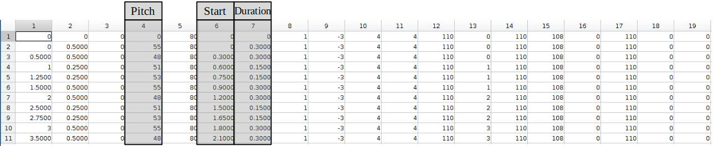
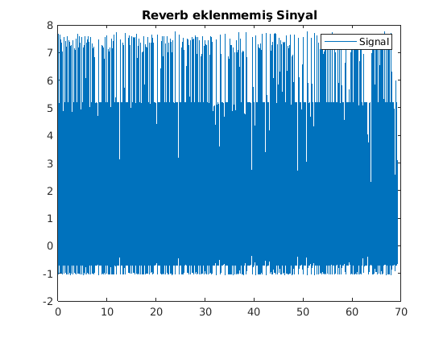
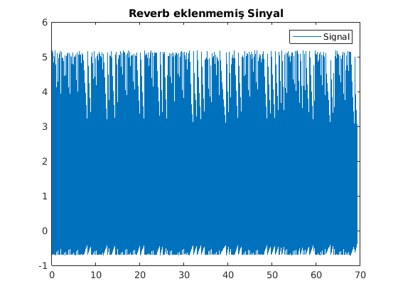
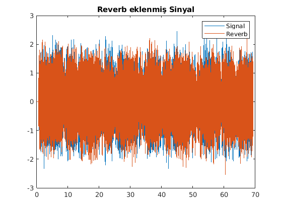
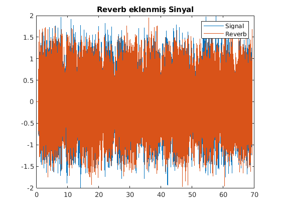
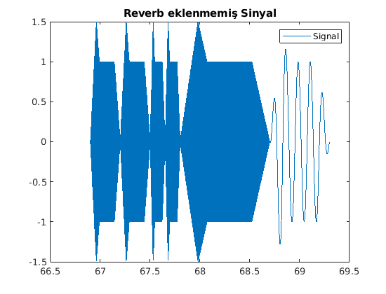
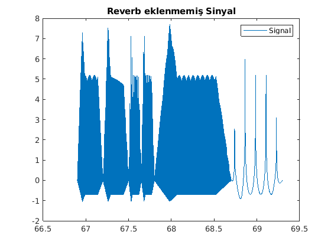
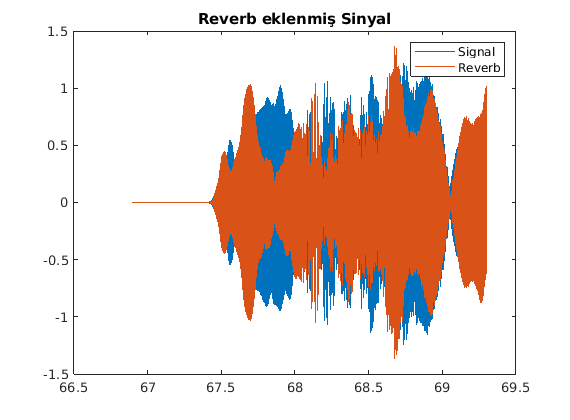
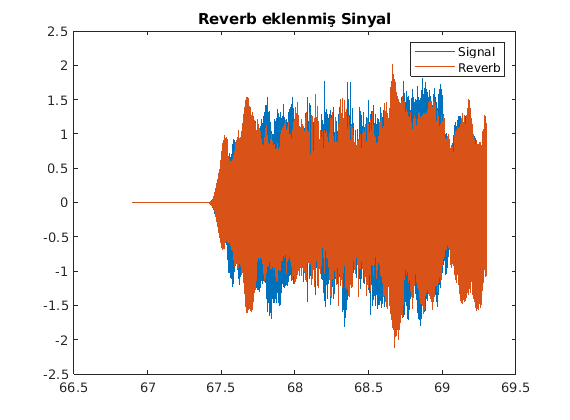

 <h1>Kişisel Bilgileri</h1>  

Öğrenci Ad-Soyad : Mohamed TRAORE 
Öğrenci   Numara : 030117024   
Ders Adı         : Sinyal İşleme 
Proje            : MATLAB ile sentezleme 

<h1>1. Hafta Hedefleri</h1>  

-Müzik notasyon programı olan MuseCore ortamında oluşturulan müziğin MATLAB ortamında parse edilmesi. 
<ul>
<li>Müziği sentezlemek üzere note.m ve sentez.m MATLAB dosyalarının oluşturulması. </li>
<li>Parse edilmiş datanın incelenmesi ve müziğin sentezleyebilmesi içi lazım olan sütunların tespit edilmesi.</li>
<li>Repoya .musicxml .mscz uzantılı müzik dosyaları ve .png uzantılı foto dosyasının eklenmesi.</li>
</ul>

  <h1>CEVAPLAR</h1>   
<h2>1. Oluşturulan müziğin .png dosyası</h2> 

 </img> 
  
 Bu müzik 16 ölçülüklü olmak üzere 229 nota ve restten  oluşmaktadır.  
   1.Ölçülük (9 tane nota ve 2 tane restten oluşmaktadır) 

 </img>

<h2>2. .musicxml uzantılı dosyanın parse edilmesi</h2>  

    
 MusicXML Parser fonksiyonu kullanılarak oluşturulan müzik parse edilir. 
     mxml = parseMusicXML('nota.musicxml');
  

<h2>3.   Müziği sentezleyebilmek için verinin lazım olan sütunları</h2>  
 
    
 notanın trigonometrik formülü : A*cos(2*pi*f*t) 
          <ul>
           <li>A : notanın genliği</li>
           <li>f : notanın frekansı</li>
           <li>t : notanın çalma zamanı (başlangıç , bitiş zamanı ve örnekleme frekansı ile bulunur)</li>
          </ul>
     dolayısıyla lazım olan sütunlar bunlardır :  
          <ul>
           <li> <h4>4.Sütun:</h4> her bir notanın middi pitch değerini vermektedir ve bu değeri frekansa çevirilerek notanun freakansı bulunur.</li>
                   
                  <pre> formül   frekans = 440*2^((pitch - 69)/12)  Hz </pre> 
                  
           <li><h4>5.Sütun:</h4> Saniye cinsinden her notanın başlangıç zamanını vermektedir.</li>
           <li><h4>6.Sütun:</h4> Saniye cinsinden her natanın ne kadar zaman sürdüğünü vermektedir. Bu değeri kullanarak bitiş zamanı bulunur.</li>
                  <pre>  bitiş zaman = başlangıç + süre </pre>
          </ul>
     Parse edilmiş Müzik örneği                                                    
     1.Ölçülük parse verileri(Sentezleme için lazım olan sütunlar belirlenmiştir) 
   

    
      </img>
     
<h1>2. Hafta Hedefleri</h1>

<ul>
<li>sentez.m scripti.</li>
<li>Exponential ve ADSR zarfların kullanılması.</li>
<li>Harmonik eklenmesi.</li>
<li>MATLAB'ın reverberation fonksiyonunu kullanarak yankı eklenmesi.</li>
<li>Program sonunda sinyal ve reverb eklenen olan sinyalin çizdirilmesi.</li>
<li>Program sonunda reverb eklenen sinyalin çaldırılması.</li>
<li>16. Ölçülükteki notaların harmonik eklenmeden eklenmiş ve reverb eklenmiş versiyonlarının grafikleri çıkartıp açıklamalara eklenmesi.</li>
</ul>

<h1>CEVAPLAR</h1>  

<h2>1. sentez.m scripti</h2>  

<pre>

parse  = parseMusicXML('nota.musicxml');                                    %Müzik parse edilir
zarf   = input('Zarf turunu seciniz : 1->exponential 2->ADSR : ');
hmk    = input('Harmonik sayisini giriniz : ');
fs     = 44100;                                                             %Örnekleme frekansı 44100 Hz
signal = [];
revSig = []; 
time   = [];
tt     = [];

for i  = 1:length(parse)
 frek  = note(parse(i,4));                                                  %Pitch'ten frekans döndürülür
 start = parse(i,6);
 dur   = parse(i,7);
 tt    = start:1/fs:(start+dur-1/fs);
 nota  = zeros(size(tt));
 
 for n = 1:hmk
         nota = nota + (1/n)*cos(2*pi*n*frek*tt);                           %Harmonikler toplanır
 end

 if(zarf==1)
     %Exponential

     ttt = 0:1/fs:dur-1/fs;
     nota = nota.*exp(-ttt/parse(i,2));                                      %Exponential zarfı ilgili notaya uygulanır

 elseif(zarf==2) 
     %ADSR
     len  = length(nota);
     env  = [linspace(0,1.5,ceil(len/5)) linspace(1.5,1,ceil(len/10)) ...   %ADSR zarfı oluşturulur
            ones(1,ceil(len/2)) linspace(1,0,ceil(len/5))];                 
     fark = length(env) - length(nota); 
     env  = env(1,1:end-fark);
     nota = nota.*env;                                                      %ADSR zarfı ilgili notaya uygulanır
  end
  signal  = horzcat(signal,nota);                                           %nota , sinyal dizisinin sonuna eklenir
  time    = horzcat(time,tt);                                               %nota süresi , time dizisinin sonuna eklenir
end
 
 reverb   =  reverberator('PreDelay',0.5,'WetDryMix',1);                    %reverberator nesnesi oluşturulur 'reverb'
 revSig   =  reverb(signal');                                               %Sonuç sinyale reverb eklenir
 plot(time,signal)                                                          %reverb eklenmemiş sinyal çizilir
 legend('Signal')
 figure
 plot(time,revSig)                                                          %reverb eklenen sinyal çizilir
 legend('Signal','Reverb')
 soundsc(revSig,fs);                                                        %reverb eklenen sinyal çaldırılır

</pre>

<h2>2.1 Notaya exponential zarfının uygulanması</h2>

<pre>
     ttt = 0:1/fs:dur-1/fs;
     nota = nota.*exp(-tt/parse(i,2));                                       %Exponential zarfı ilgili notaya uygulanır
</pre>

<h2>2.2 Notaya ADSR zarfının uygulanması  </h2>

<pre>
    %ADSR
     len  = length(nota);
     env  = [linspace(0,1.5,ceil(len/5)) linspace(1.5,1,ceil(len/10)) ...   %ADSR zarfı oluşturulur
            ones(1,ceil(len/2)) linspace(1,0,ceil(len/5))];                 
     fark = length(env) - length(nota); 
     env  = env(1,1:end-fark);
     nota = nota.*env;                                                      %ADSR zarfı ilgili notaya uygulanır
</pre>

<h2>3 Harmonik eklenmesi </h2>

<pre>
     for n = 1:hmk
         nota = nota + (1/n)*cos(2*pi*n*frek*tt);                           %Harmonikler toplanır
     end
</pre>

<h2>4 MATLAB'ın reverberation fonksiyonunu kullanarak yankı eklenmesi. </h2>

<pre>
     reverb   =  reverberator('PreDelay',0.5,'WetDryMix',1);                    %reverberator nesnesi oluşturulur 'reverb'
     revSig   =  reverb(signal');                                               %Sonuç sinyale reverb eklenir
</pre>

<h2>5.1.1 Reverb eklenmemiş Sinyal grafiği (ADSR)</h2>

  </img>

<h2>5.1.2 Reverb eklenmemiş Sinyal grafiği (EXPONENTIAL)</h2>

  </img>

<h2>5.2.1 Reverb eklenmiş Sinyal grafiği   (ADSR)</h2>

  </img>

<h2>5.2.2 Reverb eklenmiş Sinyal grafiği   (EXPONENTIAL)</h2>

  </img>

<h3> Not : </h3>

Proje boyunca sentezlenen müziğe ses efekti(yankı) olarak reverb eklenmiş.  Reverb, ses dalgalarının birçok yüzeyden yansıtılmış şekli olarak tanımlanabilir.
  
<strong>5.1.1</strong> ve <strong>5.1.2</strong> şıklardaki grafikler sentezlenen müziğin reverb eklenmeden grafikleridir. 
<strong>5.2.1</strong> ve <strong>5.2.2</strong> şıklardaki grafikler sentezlenen müziğin reverb eklenmiş grafikleridir. 
<strong>Doğrudan ses ve Yansıtılmış ses</strong>. 
Bu da müziğe sıcaklık ve derinlik katarak müziğin kapalı bir oditoryumda çalındığı izlenimini vermektedir. 
Grafiklerdeki dalgaların birleştiği yani boşlukların kaybolduğu gözlemlenmektedir. Bu da sesin çaldığı ortamdaki  
boşlukların kapatıldığı göstermektedir.

<h2>6 Reverb eklenen sinyalin çaldılırma </h2>

<pre>
      soundsc(revSig,fs);                                                        %reverb eklenen sinyal çaldırılır
</pre>

<h2> 16.Ölçülük : </h2>  

<h3> Harmonik eklenmemiş (ADSR)</h3>

    </img>

<h3> Harmonik eklenmiş   (ADSR)</h3>

    </img>

<h3> reverb eklenmiş (harmoniksiz)    (ADSR)</h3>

    </img>

<h3> reverb eklenmiş (harmonik=100)    (ADSR)</h3>

    </img>

 

<h3> Not : </h3>

Oluşturulan müziğin 16. ölçülüğünü alarak müzik üzerinde harmonikler ve reverb'in etkileri gözlemlenmiştir. 
<strong>Bir sinyalin kalitesi , bilgi kaybının miktarıyla ters orantılıdır</strong>. Yani bilgi kaydı ne kadar büyük olursa  
sinyalin kalitesi o kadar düşük olmaktadır. 
Dolayısıyla oluşturulan müziğin kalitesini iyileştirmek için harmonikleri eklenmiştir. Ve grafiklerde sinyal gerçek  
bir ses sinyaline yaklaştığı gözlemelenmektedir. 

